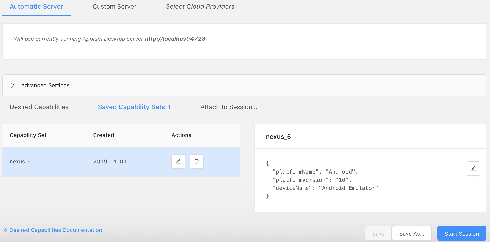
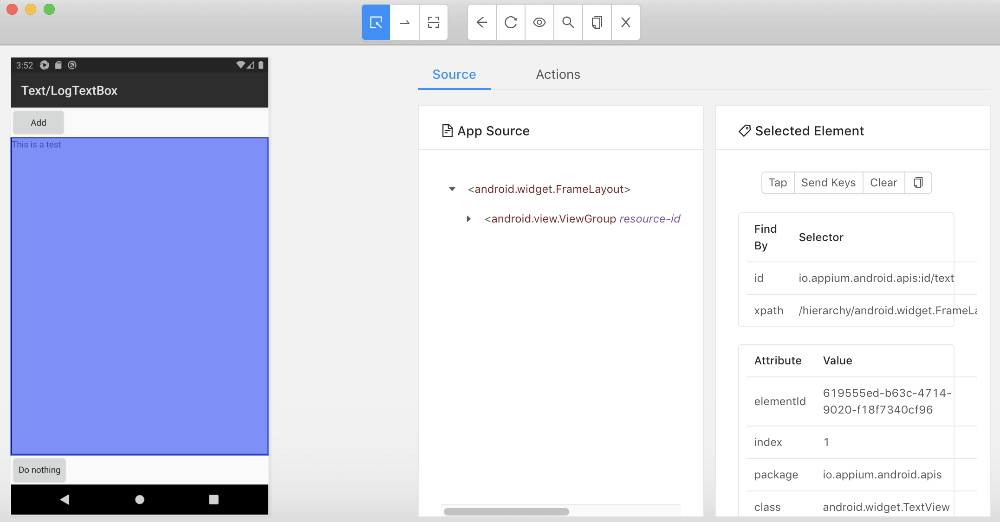
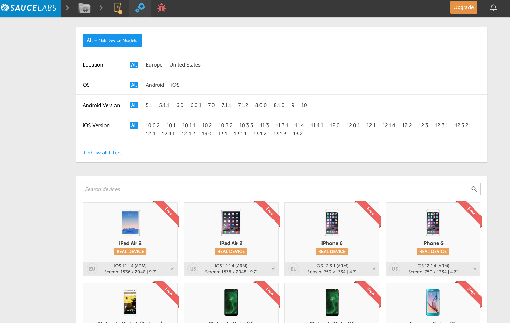
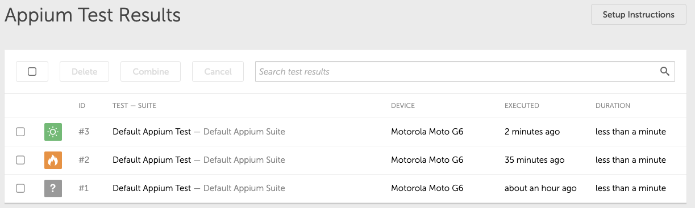
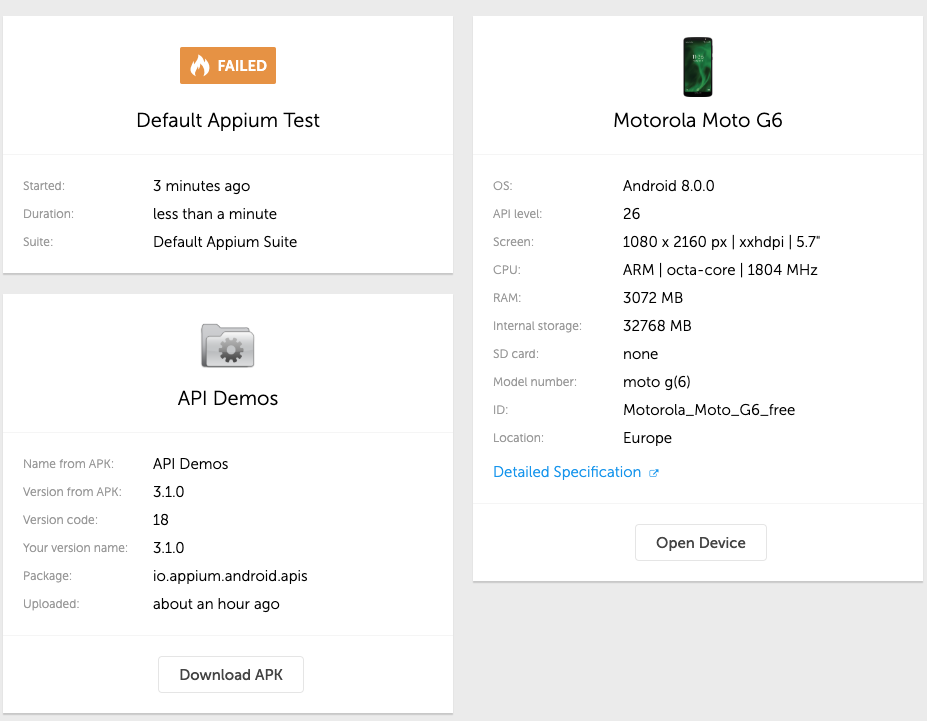

# Appium and SauceLabs End to End Testing Example

Testing your Android and iOS apps on real devices at scale.

# Requirements
    - Python 3.7+
    - Pipenv recommmended
    - Appium server for local running (Install through npm for running headless, install GUI for using the inspector)
    - Appropriate webdriver

# Using the Inspector

Assume that you are using the .apk in this directory, how do we determine the xpath and element names so we can select them? Use the inspector to do so.

1. Run AVD or iOS Emulator
2. Note down the OS version etc
3. Start Appium GUI and click on the Inspector icon
4. Specify Capability e.g.:

```json
{
  "platformName": "Android",
  "platformVersion": "10",
  "deviceName": "Android Emulator"
}
```


5. Hover over an item to get its details:




# Running Tests
Ensure Appium server is running. You can run headless mode with:

```bash
npm install -g appium
appium
```

Then to run the Python tests:
```bash
pipenv run nosetests
```

# SauceLabs
1. Click on Real Devices to setup a pipeline, this will give you endpoints and API Keys

## Uploading APK Artifact
```bash
curl -u "<Username>:<API Key>" -X POST https://app.testobject.com:443/api/storage/upload -H "Content-Type: application/octet-stream" --data-binary @your_app.apk
```
The response of the curl upload command will be the ID of the newly uploaded app. Use it to populate the testobject_app_id capability.

We can see the devices here, depending on region:


**Note:** Not all real devices are available in every region and account. Ensure that you have the right plan to unlock the devices you need and the devices are in available in the region's endpoint.

## Running a specific test
Format: `nosetests <filename>:<TestClass>:<TestName>`
```bash
pipenv run nosetests saucelabs-remote-example-test.py:TestLocalField.test_log_text_box_adds_expected_text
```

Once the test has executed, you can see it running on a real device in the Saucelabs dashboard:


